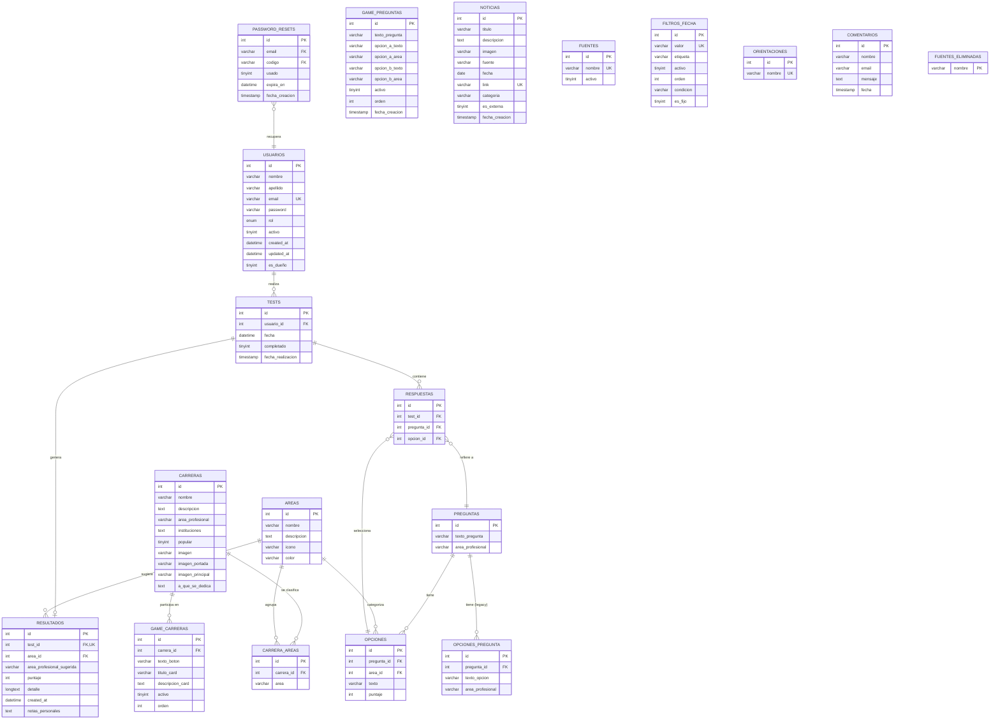

# Modelo de Datos — Futuro 360

Base de datos relacional **MySQL** (`futuro360`). Este documento describe el modelo entidad/relación,
la referencia de tablas y las relaciones entre entidades.

---

## Diagrama entidad/relación

### Versión Mermaid (se renderiza en GitHub)



### Versión texto (legible en cualquier visor)

```
USUARIOS 1 ────< N  TESTS         (un usuario realiza varios tests)
TESTS    1 ────< 1  RESULTADOS    (un test genera un único resultado)
TESTS    1 ────< N  RESPUESTAS    (un test contiene las respuestas a varias preguntas)
PREGUNTAS 1 ────< N OPCIONES      (una pregunta tiene varias opciones con puntaje por área)
AREAS    1 ────< N OPCIONES       (cada opción pertenece a un área)
PREGUNTAS 1 ────< N OPCIONES_PREGUNTA (opciones legacy del test original)
AREAS    1 ────< N RESULTADOS     (el resultado sugiere un área)
CARRERAS 1 ────< N GAME_CARRERAS  (una carrera puede aparecer en el juego)
CARRERAS 1 ────< N CARRERA_AREAS  (una carrera se asocia a varias áreas)
AREAS    1 ────< N CARRERA_AREAS  (un área agrupa varias carreras)
RESPUESTAS N ────> 1 PREGUNTAS    (cada respuesta refiere a una pregunta)
RESPUESTAS N ────> 1 OPCIONES     (cada respuesta selecciona una opción)
PASSWORD_RESETS N ────> 1 USUARIOS (códigos de recuperación por email del usuario)
```

---

## Referencia de tablas

### `usuarios`
Usuarios del sistema (visitantes registrados, administradores y el dueño).

| Campo | Tipo | Clave | Descripción |
|---|---|---|---|
| `id` | INT | PK | Identificador único |
| `nombre` | VARCHAR(100) | | Nombre |
| `apellido` | VARCHAR(100) | | Apellido |
| `email` | VARCHAR(150) | UNIQUE | Correo electrónico (usado para login y recuperación) |
| `password` | VARCHAR(255) | | Hash de la contraseña (Werkzeug) |
| `rol` | ENUM('usuario','admin') | | Rol de acceso |
| `activo` | TINYINT(1) | | 1 = habilitado, 0 = deshabilitado |
| `created_at` | DATETIME | | Fecha de alta |
| `updated_at` | DATETIME | | Última actualización |
| `es_dueño` | TINYINT(1) | | 1 = dueño del panel (permisos exclusivos) |

### `tests`
Intentos de test vocacional realizados por los usuarios.

| Campo | Tipo | Clave | Descripción |
|---|---|---|---|
| `id` | INT | PK | Identificador |
| `usuario_id` | INT | FK → `usuarios.id` | Usuario que realizó el test (borrado en cascada) |
| `fecha` | DATETIME | | Fecha del intento |
| `completado` | TINYINT(1) | | 1 = test finalizado |
| `fecha_realizacion` | TIMESTAMP | | Fecha de realización |

### `resultados`
Resultado del test: área vocacional sugerida y detalle.

| Campo | Tipo | Clave | Descripción |
|---|---|---|---|
| `id` | INT | PK | Identificador |
| `test_id` | INT | FK → `tests.id` (UNIQUE) | Test asociado (1 resultado por test) |
| `area_profesional_sugerida` | VARCHAR(100) | | Área recomendada |
| `area_id` | INT | FK → `areas.id` | Área recomendada (relación formal) |
| `puntaje` | INT | | Puntaje obtenido |
| `detalle` | LONGTEXT | | Detalle del resultado |
| `created_at` | DATETIME | | Fecha de creación |
| `notas_personales` | TEXT | | Notas editables por el usuario |

### `respuestas`
Respuestas individuales de cada pregunta dentro de un test.

| Campo | Tipo | Clave | Descripción |
|---|---|---|---|
| `id` | INT | PK | Identificador |
| `test_id` | INT | FK → `tests.id` | Test al que pertenece |
| `pregunta_id` | INT | FK → `preguntas.id` | Pregunta respondida |
| `opcion_id` | INT | FK → `opciones.id` | Opción elegida |

### `preguntas`
Preguntas del test vocacional.

| Campo | Tipo | Clave | Descripción |
|---|---|---|---|
| `id` | INT | PK | Identificador |
| `texto_pregunta` | VARCHAR(255) | | Enunciado |
| `area_profesional` | VARCHAR(100) | | Área asociada |

### `opciones`
Opciones de respuesta con puntaje por área (esquema de puntuación actual).

| Campo | Tipo | Clave | Descripción |
|---|---|---|---|
| `id` | INT | PK | Identificador |
| `pregunta_id` | INT | FK → `preguntas.id` | Pregunta (borrado en cascada) |
| `area_id` | INT | FK → `areas.id` | Área a la que suma puntaje |
| `texto` | VARCHAR(255) | | Texto de la opción |
| `puntaje` | INT | | Puntos que aporta |

### `opciones_pregunta`
Opciones del esquema original del test (legacy), conservadas por compatibilidad.

| Campo | Tipo | Clave | Descripción |
|---|---|---|---|
| `id` | INT | PK | Identificador |
| `pregunta_id` | INT | FK → `preguntas.id` | Pregunta |
| `texto_opcion` | VARCHAR(300) | | Texto de la opción |
| `area_profesional` | VARCHAR(100) | | Área |

### `areas`
Áreas profesionales del test y de las carreras.

| Campo | Tipo | Clave | Descripción |
|---|---|---|---|
| `id` | INT | PK | Identificador |
| `nombre` | VARCHAR(100) | | Nombre del área |
| `descripcion` | TEXT | | Descripción |
| `icono` | VARCHAR(50) | | Ícono asociado |
| `color` | VARCHAR(20) | | Color representativo |

### `carreras`
Catálogo de carreras de la plataforma.

| Campo | Tipo | Clave | Descripción |
|---|---|---|---|
| `id` | INT | PK | Identificador |
| `nombre` | VARCHAR(150) | | Nombre de la carrera |
| `descripcion` | TEXT | | Descripción |
| `area_profesional` | VARCHAR(100) | | Área principal |
| `instituciones` | TEXT | | Instituciones donde se dicta |
| `popular` | TINYINT(1) | | Marca si es popular |
| `imagen` / `imagen_portada` / `imagen_principal` | VARCHAR(500) | | Rutas de imágenes |
| `a_que_se_dedica` | TEXT | | Descripción del campo laboral |

### `carrera_areas`
Tabla puente entre carreras y áreas.

| Campo | Tipo | Clave | Descripción |
|---|---|---|---|
| `id` | INT | PK | Identificador |
| `carrera_id` | INT | FK → `carreras.id` | Carrera |
| `area` | VARCHAR(100) | | Área asociada |

### `game_carreras`
Configuración de las carreras que participan en el juego de descubrimiento.

| Campo | Tipo | Clave | Descripción |
|---|---|---|---|
| `id` | INT | PK | Identificador |
| `carrera_id` | INT | FK → `carreras.id` | Carrera |
| `texto_boton` | VARCHAR(100) | | Texto del botón |
| `titulo_card` / `descripcion_card` | VARCHAR / TEXT | | Contenido de la tarjeta |
| `activo` | TINYINT(1) | | Visible o no |
| `orden` | INT | | Orden de aparición |
| `boton_no` / `boton_info` / `boton_yes` | VARCHAR(100) | | Textos de botones |

### `game_preguntas`
Preguntas del juego.

| Campo | Tipo | Clave | Descripción |
|---|---|---|---|
| `id` | INT | PK | Identificador |
| `texto_pregunta` | VARCHAR(300) | | Enunciado |
| `opcion_a_texto` / `opcion_b_texto` | VARCHAR(200) | | Textos de las dos opciones |
| `opcion_a_area` / `opcion_b_area` | VARCHAR(100) | | Áreas de cada opción |
| `activo` | TINYINT(1) | | Visible o no |
| `orden` | INT | | Orden |
| `fecha_creacion` | TIMESTAMP | | Fecha de alta |

### `noticias`
Noticias educativas mostradas en la sección de noticias.

| Campo | Tipo | Clave | Descripción |
|---|---|---|---|
| `id` | INT | PK | Identificador |
| `titulo` | VARCHAR(300) | | Título |
| `descripcion` | TEXT | | Cuerpo/resumen |
| `imagen` | VARCHAR(500) | | Imagen |
| `fuente` | VARCHAR(100) | | Fuente (nombre del medio) |
| `fecha` | DATE | | Fecha de la noticia |
| `link` | VARCHAR(500) | UNIQUE | Enlace de origen |
| `categoria` | VARCHAR(100) | | Categoría |
| `es_externa` | TINYINT(1) | | 1 = redirige a link externo |
| `fecha_creacion` | TIMESTAMP | | Fecha de alta |

### `fuentes`
Fuentes de noticias disponibles.

| Campo | Tipo | Clave | Descripción |
|---|---|---|---|
| `id` | INT | PK | Identificador |
| `nombre` | VARCHAR(100) | UNIQUE | Nombre de la fuente |
| `activo` | TINYINT(1) | | Habilitada o no |

### `fuentes_eliminadas`
Registro de nombres de fuentes eliminadas (evita que una fuente dada de baja reingrese).

| Campo | Tipo | Clave | Descripción |
|---|---|---|---|
| `nombre` | VARCHAR(100) | PK | Nombre de la fuente eliminada |

### `filtros_fecha`
Filtros de tiempo ofrecidos al usuario en la sección de noticias.

| Campo | Tipo | Clave | Descripción |
|---|---|---|---|
| `id` | INT | PK | Identificador |
| `valor` | VARCHAR(20) | UNIQUE | Valor interno del filtro |
| `etiqueta` | VARCHAR(50) | | Texto visible |
| `activo` | TINYINT(1) | | Habilitado |
| `orden` | INT | | Orden de aparición |
| `condicion` | VARCHAR(250) | | Condición SQL de filtrado |
| `es_fijo` | TINYINT(1) | | No editable por el admin |

### `orientaciones`
Orientaciones/áreas de agrupación de carreras gestionables desde el panel.

| Campo | Tipo | Clave | Descripción |
|---|---|---|---|
| `id` | INT | PK | Identificador |
| `nombre` | VARCHAR(100) | UNIQUE | Nombre de la orientación |

### `comentarios`
Mensajes de contacto de los visitantes.

| Campo | Tipo | Clave | Descripción |
|---|---|---|---|
| `id` | INT | PK | Identificador |
| `nombre` | VARCHAR(100) | | Nombre del remitente |
| `email` | VARCHAR(100) | | Email |
| `mensaje` | TEXT | | Contenido |
| `fecha` | TIMESTAMP | | Fecha |

### `password_resets`
Códigos PIN de recuperación de contraseña.

| Campo | Tipo | Clave | Descripción |
|---|---|---|---|
| `id` | INT | PK | Identificador |
| `email` | VARCHAR(255) | FK → `usuarios.email` (lógica) | Email del usuario |
| `codigo` | VARCHAR(6) | FK (lógica) | Código PIN de 6 dígitos |
| `usado` | TINYINT(1) | | 1 = código ya utilizado |
| `expira_en` | DATETIME | | Fecha de expiración |
| `fecha_creacion` | TIMESTAMP | | Fecha de creación |

---

## Relaciones entre entidades (resumen)

| Origen | Cardinalidad | Destino | Columna |
|---|---|---|---|
| `usuarios` | 1 : N | `tests` | `tests.usuario_id` |
| `tests` | 1 : 1 | `resultados` | `resultados.test_id` |
| `tests` | 1 : N | `respuestas` | `respuestas.test_id` |
| `preguntas` | 1 : N | `opciones` | `opciones.pregunta_id` |
| `preguntas` | 1 : N | `opciones_pregunta` | `opciones_pregunta.pregunta_id` |
| `areas` | 1 : N | `opciones` | `opciones.area_id` |
| `areas` | 1 : N | `resultados` | `resultados.area_id` |
| `respuestas` | N : 1 | `preguntas` | `respuestas.pregunta_id` |
| `respuestas` | N : 1 | `opciones` | `respuestas.opcion_id` |
| `carreras` | 1 : N | `game_carreras` | `game_carreras.carrera_id` |
| `carreras` | 1 : N | `carrera_areas` | `carrera_areas.carrera_id` |
| `usuarios` | 1 : N | `password_resets` | `password_resets.email` (lógica) |

---

## Consideraciones de diseño

- **Claves primarias** definidas en todas las tablas (`id` autoincremental).
- **Claves foráneas** con `ON DELETE CASCADE` donde corresponde (tests → resultados, tests → respuestas,
  preguntas → opciones, preguntas → opciones_pregunta), garantizando integridad referencial.
- **Unicidad** en campos clave: `usuarios.email`, `noticias.link`, `fuentes.nombre`,
  `orientaciones.nombre`, `filtros_fecha.valor`, `resultados.test_id`.
- **Normalización**: el modelo está normalizado hasta la **3ª Forma Normal** (tablas de áreas y
  categorías separadas de las entidades que las usan; datos no repetidos; cada tabla depende de su PK).
- El esquema SQL completo se encuentra en `base de datos/futuro 360.sql` (migraciones históricas en
  `migracion_parte1.sql` y `migracion_parte2.sql`).
